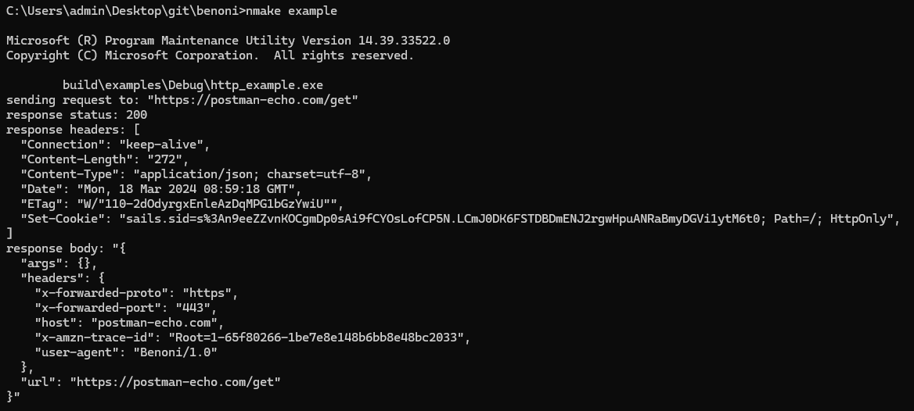
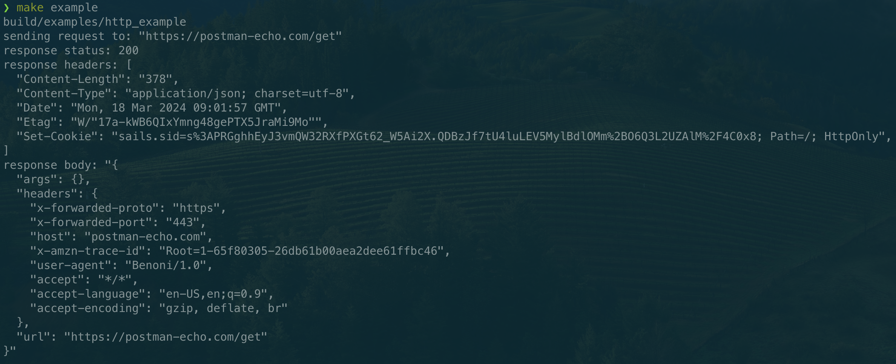
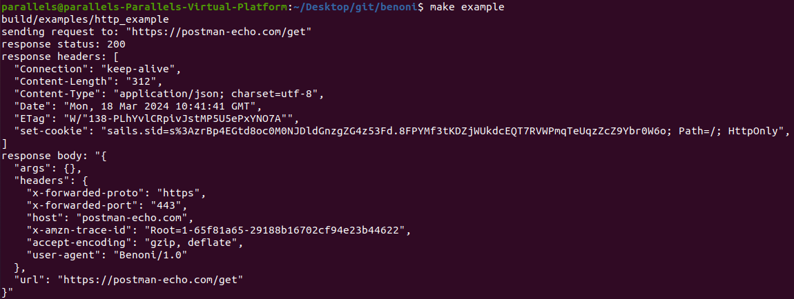

# Benoni

A C++ HTTP client that uses [WinHTTP](https://learn.microsoft.com/en-us/windows/win32/winhttp/winhttp-start-page) on Windows, [NSURLSession](https://developer.apple.com/documentation/foundation/url_loading_system) on Apple and [libsoup](https://libsoup.org) on GNOME.

## Demo

Here is the output of the demo program in [`http_example.cc`](examples/http_example.cc) on all supported systems:

### Windows

### Apple

### GNOME

## Contributing

Take a look at [the contributing guide](./CONTRIBUTING.md).
